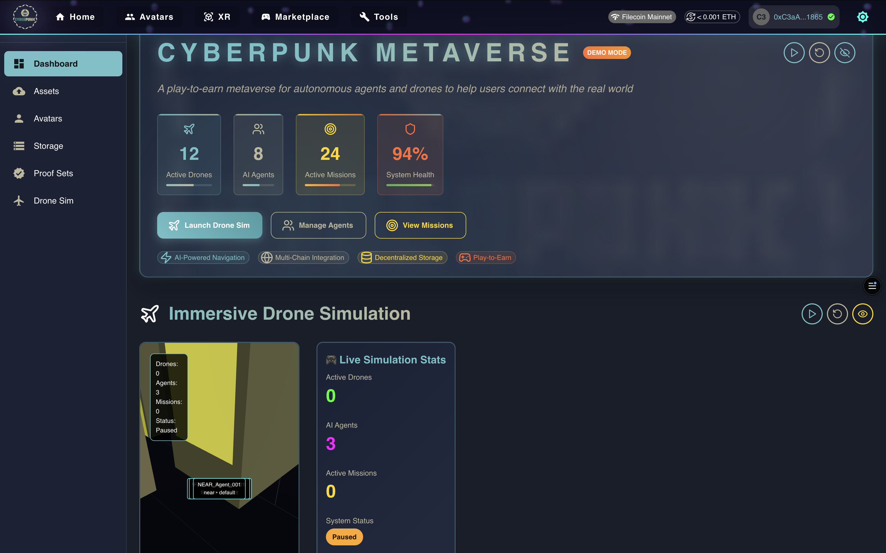

# 🎮 CyberPunk WildNet Metaverse

CyberPunk: WildNet is an AR-driven PLAY-to-EARN real-world metaverse game that lets players remotely control drones to explore wildlife zones, discover virtual collectibles, interact with AI NPCs, contribute real conservation data, and earn crypto rewards.



## 🌆 Overview

CyberPunk WildNet is a next-generation metaverse that showcases:

- **Avatar Creation & Customization**: Create unique cyberpunk onchain avatars with customizable appearances
- **Metaverse Asset Management**: Upload, store, and manage digital assets on Filecoin
- **Decentralized Storage**: Secure file storage using Filecoin Synapse with USDFC payments
- **Blockchain Integration**: Seamless wallet connection and blockchain-based asset ownership
- **Cyberpunk Aesthetic**: Immersive neon-lit interface with futuristic UI elements
- **3D Drone Simulation**: Interactive 3D environment for drone control and agent interactions
- **Onchain Agent System**: Flow blockchain-powered autonomous agents with smart contracts

## 📋 Table of Contents

- [Contracts](#contracts)
- [Features](#-features)
- [Technology Stack](#️-technology-stack)
- [Architecture Overview](#️-architecture-overview)
- [Drone Simulation & Agent System](#-drone-simulation--agent-interaction-system)
- [Getting Started](#-getting-started)
- [How to Use](#-how-to-use)
- [Demo Mode](#-demo-mode)
- [Testing](#-testing)
- [Future Enhancements](#-future-enhancements)

## CONTRACTS

FILECOIN CONTRACTS [VIEW](/Docs/filecoin-contracts.md)

FLOW CONTRACTS [VIEW](/Docs/flow-contracts.md)

NEAR CONTRACTS [VIEW](/Docs/near-contracts.md)

## 🚀 Features

### Avatar System
- Customizable cyberpunk avatars with skin tones, hair styles, and cybernetic enhancements
- Persistent avatar data stored on Filecoin
- Level progression and reputation system
- Inventory management with weapons, clothing, and cybernetic items
- **🔗 [Access Avatar Creator](https://cyberpunk-metaverse.vercel.app/avatars)**

### Asset Management
- Upload and manage metaverse assets (avatars, buildings, vehicles, weapons, clothing, textures, audio, scripts)
- Categorized asset storage with Filecoin CID tracking
- Real-time storage statistics and capacity monitoring
- Access control and ownership verification
- **🔗 [Access Asset Manager](https://cyberpunk-metaverse.vercel.app/assets)**

### Analytics Dashboard
- **Live stats**: See total agents, active agents, total missions, and completed missions in real time
- **MUI-based UI**: Clean, responsive layout using Material UI components
- **Mission tracking**: Monitor completion rates and agent activity
- **Real-time updates**: Automatic refresh as data changes
- **🔗 [Access Analytics Dashboard](https://cyberpunk-metaverse.vercel.app/analytics)**

### Drone Simulation
- Interactive 3D environment for drone control and agent interactions
- Real-time drone status monitoring and mission management
- Physics-based simulation with Three.js and React Three Fiber
- Onchain agent interactions via Flow blockchain
- **🔗 [Access Drone Simulation](https://cyberpunk-metaverse.vercel.app/drone-sim)**

### Storage Management
- Filecoin-based decentralized storage with USDFC payments
- Proof set verification and file integrity checking
- Storage capacity monitoring and payment management
- **🔗 [Access Storage Manager](https://cyberpunk-metaverse.vercel.app/storage)**

### Data Bridge & Tools
- Cross-chain data bridging and asset management
- Onramp functionality for seamless asset integration
- Metaverse tools and utilities
- **🔗 [Access Data Bridge](https://cyberpunk-metaverse.vercel.app/databridge)**
- **🔗 [Access Tools](https://cyberpunk-metaverse.vercel.app/tools)**

### Proof Sets
- View and manage proof sets for file verification
- Download and share proof sets for data integrity
- **🔗 [Access Proof Sets](https://cyberpunk-metaverse.vercel.app/proofsets)**

## 🛠️ Technology Stack

### Frontend & UI
- **Next.js 15** - React framework with App Router
- **React 19** - Latest React with concurrent features
- **TypeScript** - Type-safe development
- **Material-UI (MUI) 7** - Component library with cyberpunk theme
- **Tailwind CSS** - Utility-first styling
- **Framer Motion** - Smooth animations and transitions

### 3D Graphics & Visualization
- **Three.js** - 3D graphics library
- **React Three Fiber** - React renderer for Three.js
- **React Three Drei** - Useful helpers and abstractions
- **React Three Cannon** - Physics engine integration
- **React Three Rapier** - Advanced physics

### Blockchain Integration
- **Flow Blockchain** - Primary blockchain for agent interactions
- **Filecoin** - Decentralized storage solution
- **Near Protocol** - Additional blockchain support
- **Wagmi + RainbowKit** - Ethereum/Filecoin wallet integration
- **FCL (Flow Client Library)** - Flow blockchain interactions

### Data Management
- **React Query (TanStack Query)** - Server state management
- **Filecoin Synapse SDK** - Storage and payment processing
- **IPFS/Filecoin** - Decentralized file storage

## 🏗️ Architecture Overview

### Core Components
- **AvatarCreator**: Cyberpunk avatar customization interface
- **MetaverseAssetManager**: Asset upload and management system
- **StorageManager**: Filecoin storage and payment management
- **FileUploader**: File upload to Filecoin with progress tracking
- **ViewProofSets**: Proof set verification and management
- **DroneSimDashboard**: Main simulation interface with 3D visualization
- **DroneSim3DView**: Interactive 3D canvas for drone and agent visualization

### Hooks & Utilities
- **useMetaverse**: Avatar and world state management
- **useMetaverseAssets**: Asset storage and Filecoin integration
- **useBalances**: USDFC and FIL balance tracking
- **usePayment**: Synapse payment processing
- **useFileUpload**: File upload to Filecoin
- **useAgents**: Agent state management and operations
- **useDrones**: Drone simulation and mission management

### Data Flow & State Management
- **React Query Integration**: Centralized state management with caching
- **State Synchronization**: Local state → React Query Cache → API Endpoints
- **Blockchain Events**: Flow Contract → UI Updates
- **3D Scene**: Three.js State → Component Props

### Metaverse Settings
Adjust world parameters and game mechanics:

```ts
metaverse: {
  maxPlayers: 1000,
  worldSize: { width: 10000, height: 1000, depth: 10000 },
  gameMechanics: {
    currency: "CYBER",
    maxInventorySlots: 50,
    tradingEnabled: true,
    pvpEnabled: true,
    questSystem: true,
    craftingSystem: true,
    reputationSystem: true
  }
}
```

## 🎯 Drone Simulation & Agent Interaction System

### 3D Canvas & Scene Management

The Drone Simulation features an interactive 3D environment built with Three.js and React Three Fiber:

```tsx
<Canvas camera={{ position: [0, 50, 100], fov: 60 }} shadows>
  <Sky sunPosition={[100, 20, 100]} />
  <ambientLight intensity={0.5} />
  <directionalLight position={[10, 10, 5]} intensity={1} castShadow />
  <Environment preset="city" />
  <Physics>
    {/* 200x200 meter ground plane */}
    <mesh receiveShadow position={[0, 0, 0]} rotation={[-Math.PI / 2, 0, 0]}>
      <planeGeometry args={[200, 200]} />
      <meshStandardMaterial color="#1a2236" />
    </mesh>
    {/* Interactive 3D objects */}
    {drones.map((drone) => <Drone3D key={drone.id} drone={drone} />)}
    {agents.map((agent) => <Agent3D key={agent.id} agent={agent} />)}
  </Physics>
  <OrbitControls />
</Canvas>
```

**Canvas Features:**

- **Interactive 3D Environment**: 200x200 meter ground plane with cyberpunk city aesthetic
- **Dynamic Lighting**: Ambient and directional lighting with shadows
- **Physics Integration**: Cannon.js physics for realistic object interactions
- **Camera Controls**: Orbit controls for user navigation
- **Real-time Updates**: 3D objects sync with application state

### 3D Objects & Interactions

**Drones:**
- **Visual Representation**: Box geometry with status-based color coding
- **Interactive Elements**: Click to select and view drone information
- **Status Indicators**: Green (in-mission), Yellow (charging), Cyan (idle), Pink (selected)
- **Physics Integration**: Mass-based physics for realistic movement

**Agents:**
- **Visual Representation**: Sphere geometry with type-based color coding
- **Type Indicators**: Magenta (onchain), Orange (hybrid), Cyan (offchain)
- **Static Physics**: Non-moving agents with collision detection

### Onchain Agent Functionalities with Flow Blockchain

#### Flow Smart Contract (AgentNPCContract.cdc)
```cadence
access(all) contract AgentNPC {
    access(all) event MissionAssigned(agent: Address, drone: Address, missionId: String)
    access(all) event AgentInteracted(agent: Address, target: Address, message: String)
    
    access(all) resource Agent {
        access(all) let id: UInt64
        access(all) var missionCount: UInt64
        access(all) var interactionCount: UInt64
        access(all) var isActive: Bool
        
        access(all) fun assignMission(owner: Address, drone: Address, missionId: String)
        access(all) fun interactWith(owner: Address, target: Address, message: String)
        access(all) fun getAgentStats(): {String: AnyStruct}
    }
}
```

#### Onchain Agent Operations

**1. Mission Assignment:**
```typescript
export async function assignMissionOnChain(droneAddress: string, missionId: string) {
  const txId = await fcl.mutate({
    cadence: `
      import AgentNPC from 0xAgentNPC
      transaction(drone: Address, missionId: String) {
        prepare(signer: AuthAccount) {
          let agent <- AgentNPC.createAgent()
          agent.assignMission(owner: signer.address, drone: drone, missionId: missionId)
          destroy agent
        }
      }
    `,
    args: (arg, t) => [
      arg(droneAddress, t.Address),
      arg(missionId, t.String)
    ],
    proposer: fcl.currentUser().authorization,
    payer: fcl.currentUser().authorization,
    authorizations: [fcl.currentUser().authorization],
    limit: 100,
  });
  return txId;
}
```

**2. Agent Interactions:**
```typescript
export async function interactWithAgentOnChain(targetAddress: string, message: string) {
  const txId = await fcl.mutate({
    cadence: `
      import AgentNPC from 0xAgentNPC
      transaction(target: Address, message: String) {
        prepare(signer: AuthAccount) {
          let agent <- AgentNPC.createAgent()
          agent.interactWith(owner: signer.address, target: target, message: message)
          destroy agent
        }
      }
    `,
    args: (arg, t) => [
      arg(targetAddress, t.Address),
      arg(message, t.String)
    ],
    proposer: fcl.currentUser().authorization,
    payer: fcl.currentUser().authorization,
    authorizations: [fcl.currentUser().authorization],
    limit: 100
  });
  return txId;
}
```

#### Agent Types & Capabilities

**Agent Classification:**
- **Onchain Agents**: Fully blockchain-based with Flow smart contracts
- **Offchain Agents**: Local simulation agents
- **Hybrid Agents**: Combination of onchain and offchain capabilities

**Agent Strategies:**
- **Default**: Basic autonomous behavior
- **Assigner**: Mission assignment and coordination
- **Trader**: Economic interactions and resource management
- **Social**: Communication and collaboration

## 📋 Prerequisites

- Node.js 18+ and npm
- A web3 wallet (like MetaMask)
- Basic understanding of React and TypeScript
- Get some tFIL tokens on Filecoin Calibration testnet [link to faucet](https://faucet.calibnet.chainsafe-fil.io/funds.html)
- Get some USDFC tokens on Filecoin Calibration testnet [link to faucet](https://forest-explorer.chainsafe.dev/faucet/calibnet_usdfc)

## 🚀 Getting Started

1. Clone this repository:
```bash
git clone https://github.com/monyverse/cyberpunk
cd cyberpunk
```

2. Install dependencies:
```bash
npm install
```

3. Run the development server:
```bash
npm run dev
```

Open [http://localhost:3000](http://localhost:3000) to enter the CyberPunk Metaverse.

## 🎮 How to Use

### 1. Connect Your Wallet
- Click "Connect Wallet" to link your Web3 wallet
- Ensure you're connected to Filecoin Calibration network
- Make sure you have USDFC tokens for storage payments

### 2. Create Your Avatar
- Navigate to the "Create Avatar" tab
- Customize your cyberpunk appearance
- Choose skin tone, hair style, hair color, and cybernetic eye color
- Enter your avatar name and create your digital identity

### 3. Manage Metaverse Assets
- Upload digital assets (3D models, textures, audio, etc.)
- Organize assets by category (avatars, buildings, vehicles, etc.)
- Monitor storage usage and Filecoin CID references
- Delete or manage existing assets

### 4. Storage Management
- Deposit USDFC to Synapse contracts for storage payments
- Monitor storage capacity and persistence periods
- View proof sets and file verification status

### 5. Drone Simulation
- Navigate to the "Drone Sim" section
- Add drones and missions to the 3D environment
- Interact with agents through the Flow blockchain
- Monitor real-time drone and agent status

### 6. Analytics Dashboard
- Navigate to `/analytics` in your browser
- View live statistics for agents and missions
- Use demo mode to populate with sample data
- Monitor mission completion rates and agent activity

### 6. Analytics Dashboard
- Navigate to `/analytics` in your browser
- View live statistics for agents and missions
- Use demo mode to populate with sample data
- Monitor mission completion rates and agent activity

## 🎮 Demo Mode (Seeding Mock Data)

To quickly populate the app with mock agents and missions for demos or testing:

### UI Toggle
- Use the "Demo" switch in the navbar to seed/reset demo data
- Visual indicators show when demo mode is active
- Success/error notifications appear when toggling

### API Endpoints
- **Seed demo data:**
  ```sh
  curl -X POST http://localhost:3000/api/demo/seed
  ```
- **Reset demo data:**
  ```sh
  curl -X POST http://localhost:3000/api/demo/reset
  ```
- **Check demo status:**
  ```sh
  curl -X GET http://localhost:3000/api/demo/status
  ```

### Demo Features
- **Mock Agents**: Pre-configured agents with different types and strategies
- **Sample Missions**: Various mission types (mapping, surveillance, delivery)
- **Visual Indicators**: Demo mode chips throughout the interface
- **3D Visualization**: Interactive demo data in the drone simulation

This will seed/reset in-memory demo data for agents and missions. (You can extend this to persist to a DB or localStorage as needed.)

## 🧪 Testing

### Running Playwright Tests

1. **Install Playwright (if not already):**
   ```sh
   npx playwright install
   ```
2. **Run all tests:**
   ```sh
   npx playwright test
   ```
3. **Open Playwright Test UI:**
   ```sh
   npx playwright test --ui
   ```

- Make sure your dev server is running (`npm run dev`) before running E2E tests.
- You can use demo mode to seed data before running tests for consistent results.

### Test Coverage
- **Analytics Dashboard**: E2E tests for demo controls and data visualization
- **Component Testing**: Individual component functionality
- **API Testing**: Endpoint validation and error handling

## 🔮 Future Enhancements

### Planned Features
1. **VR/AR Integration**: React Three XR for immersive experiences
2. **Advanced Physics**: React Three Rapier for complex simulations
3. **Multiplayer Support**: Real-time agent interactions
4. **AI Integration**: Machine learning for autonomous behaviors
5. **Mobile Optimization**: Progressive Web App capabilities

### Scalability Considerations
- **Microservices Architecture**: API separation for different modules
- **Database Integration**: Persistent storage for user data
- **CDN Optimization**: Global content delivery
- **Blockchain Scaling**: Layer 2 solutions for high throughput

### UI/UX Improvements
- **Enhanced 3D Controls**: Advanced camera and interaction systems
- **Real-time Collaboration**: Multi-user drone control and agent interaction
- **Advanced Analytics**: Machine learning insights and predictive analytics
- **Mobile Responsiveness**: Optimized mobile experience

---

## 📄 License

This project is licensed under the MIT License - see the [LICENSE](LICENSE) file for details.

## 🤝 Contributing

Contributions are welcome! Please feel free to submit a Pull Request.

---

**CyberPunk WildNet** - Where the digital and physical worlds collide in a neon-lit future.
